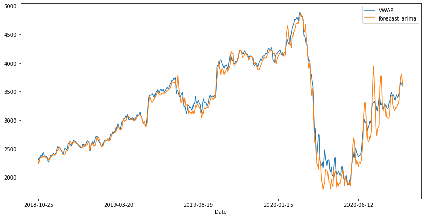

# Overview

- This script is created to predict stock market prices (VWAP) using the ARIMA model

# EDA

- Prediction Target: VWAP (Volume Weighted Average Price).

The VWAP is a trading benchmark used by traders to show the average price of securities traded throughout the day based on the volume and price, this allows traders to gain insight into the trend and value of securities and may be used as a trend confirmation tool.

- Graph of VWAP against date

From this graph, we can conclude that:

1. The mean and the standard deviation is not constant throughout the data.
2. The data is being affected by seasonality (a huge drop may be because of covid-19)
3. The time series is not stationary

- NaN values

There are NaN values in Trades, Deliverable Volume, and %Deliverable columns. Mode than 50% of data in Trades is NaN.

# Feature Engineering

Because the mean of VWAP is not constant (have a high variety), Moving Average with a window of 3 and 7 will be engineered from [&#39;High&#39;,&#39;Low&#39;,&#39;Volume&#39;,&#39;Turnover&#39;,&#39;Trades&#39;] columns. This will smooth out price trends by filtering out the &quot;noise&quot; of random short-term price fluctuations. The most common use of moving averages is to determine trend direction and determine support and resistance levels.

# Modelling

- Data will be split into 20% for testing and 30% for training.

- Predictions are done by the ARIM model:

ARIMA model is a type of statistical model used to analyze and forecast time series data, ARIMA itself stands for:

AR: Autoregression. A model that uses observations from the previous time step as input to predict the value of future time steps.

 I: Integrated. Differencing of raw observations to make the time series stationary.

 MA: Moving average. The average change of the data series over time.

# Prediction Results and Evaluations

RMSE= 136.14

MAE=91.85

With a relatively low RMSE and MAE, the model could most likely predict VWAP of this particular stock. However, other external factors should always be taken into consideration towards the fluctuation of market prices.
